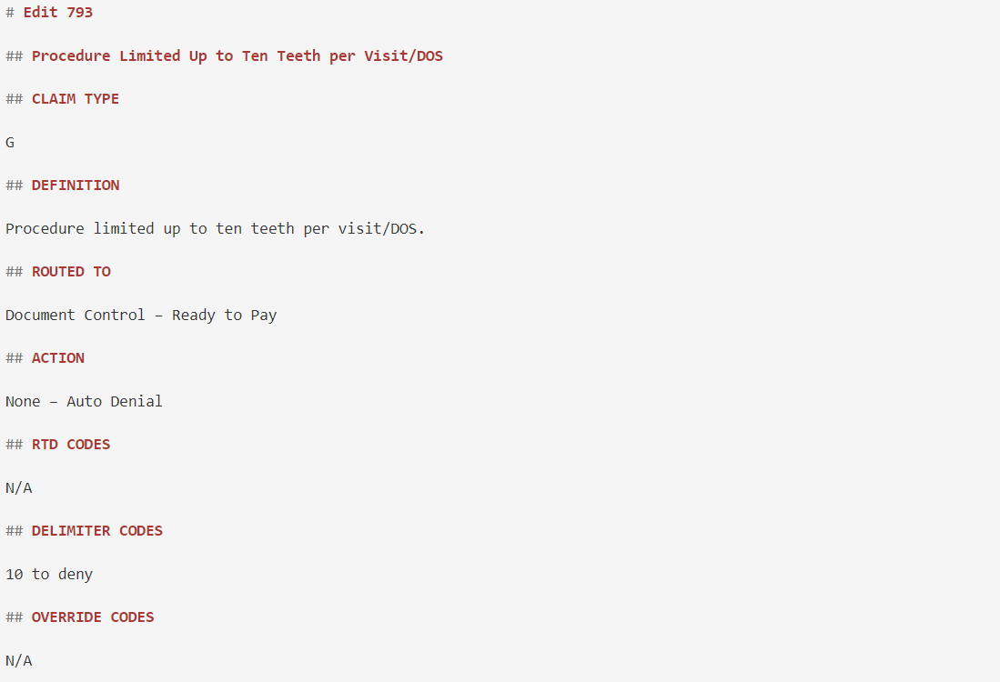

# Markdown Table Reformatting and Conversion

This script was used to reformat Markdown files that had been created using *** Reference Guides. All of the material had been formatted within tables,
but it was later decided to take the content out of the tables to better fit MkDocs. Since there were hundreds of files to go through, this script completed
most of the reformatting work so that only small additional changes were required.

      # Reformatting Tables into Headings and Content

      ## Code should iterate through files in selected folder and identify the table. 
      The left column of the table should be converted to second-level headings and the right column of the table should be 
      converted to the contents within the associated heading. 

      import re

      # function to find table and the split the table as requested and then rewrite within the file
      def format_table_in_file(file_path):
          with open(file_path, 'r', encoding='utf-8') as file:
              file_contents = file.read()

          # Extract the table portion from the file content
          table_match = re.search(r'\| \*\*Field\*\*[\s\S]*?(?=\n\n|$)', file_contents)
          if not table_match:
              print("Table not found in the file.")
              return
      
          table_text = table_match.group(0)
      
          # Split the table text into lines
          lines = table_text.strip().split("\n")
      
          # Extract the data
          data_lines = lines[2:]  # Skip the header and the line separating header and data
          data = [line.split('|') for line in data_lines]
      
          # Format the table into desired format
          formatted_table = ""
          for row in data:
              if len(row) >= 2:
                  field = row[1].strip()  # Remove leading and trailing whitespace
                  description = row[2].strip() if len(row) >= 3 else ""  # Handle cases where description might be missing
                  formatted_table += f"## {field}\n\n{description}\n\n"
      
          # Replace the original table in the file with the formatted table
          modified_contents = re.sub(re.escape(table_text), formatted_table, file_contents)
      
          # Write the modified contents back to the file
          with open(file_path, 'w', encoding='utf-8') as file:
              file.write(modified_contents)
      
          print("Table successfully formatted and written to the file.")
      
      import os
      
      def format_tables_in_folder(folder_path):
          # Iterate over all files in the folder
          for filename in os.listdir(folder_path):
              # Check if the file is a Markdown file
              if filename.endswith(".md"):
                  file_path = os.path.join(folder_path, filename)
                  format_table_in_file(file_path)

      # Specify the folder path containing the Markdown files
      folder_path = "docs/Suspense and Error Manual/Recipient Edits"
      
      # Format tables in all files in the folder
      format_tables_in_folder(folder_path)

Example of table before the conversion

Example of table after the conversion

3/26/2024 
