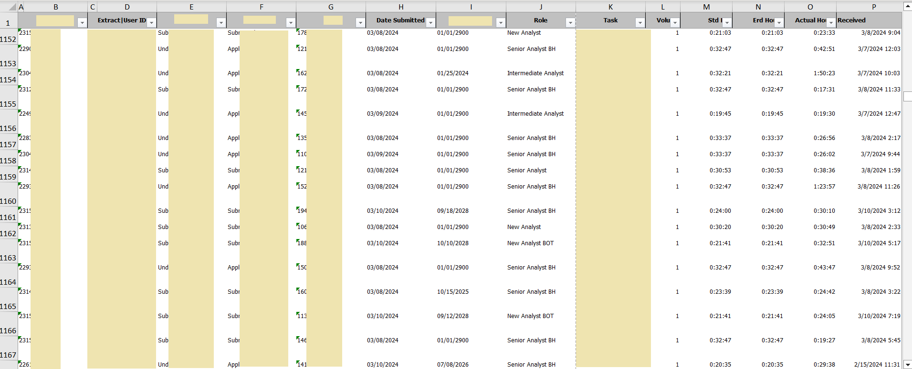
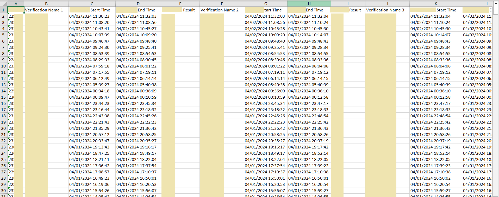
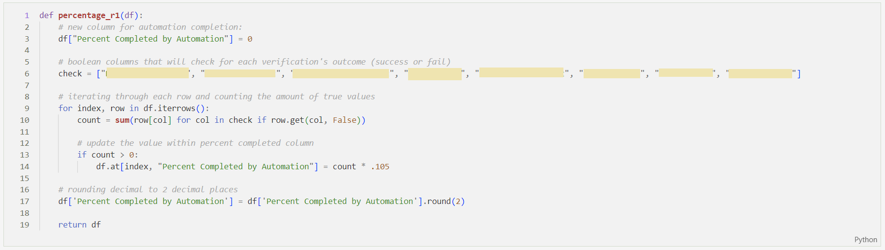
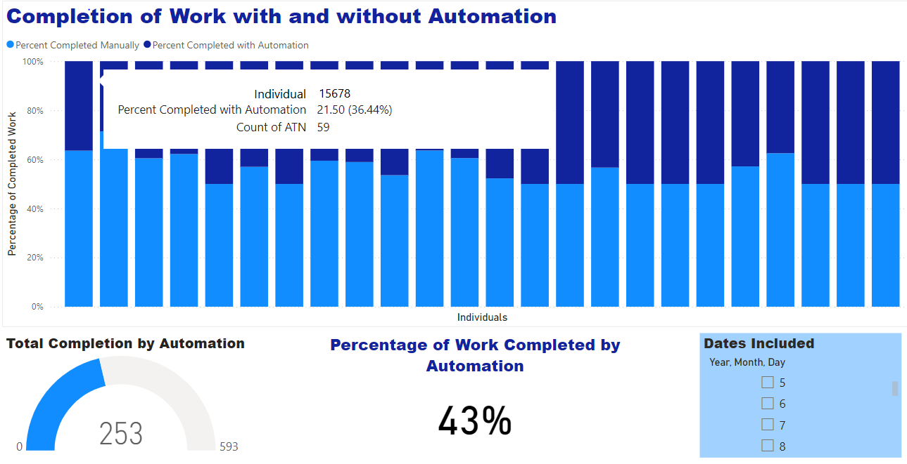
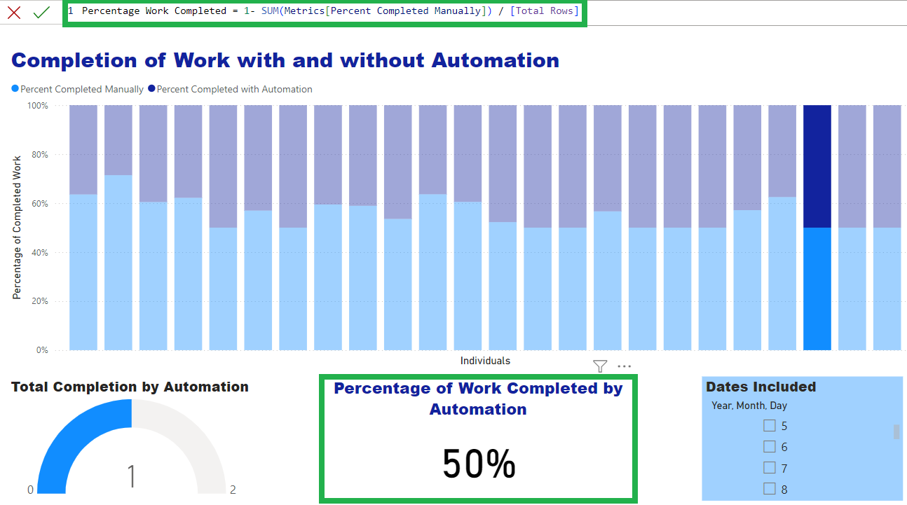

# Value Analysis of Automation

This project involved a **value analysis of a digital automation process**, focusing on quantifying the manual work completed by a bot relative to the total work. Utilizing **Power BI, Python, and Excel**, the analysis covered a process with 8 automated steps. The bot's performance varied based on task complexity, with the potential to complete up to 100% of the work. The analysis evaluated the extent of automation versus manual intervention and the results allow for time studies of manual work to **calculate metrics such as FTEs saved and cost savings**. Provided below are highlights and keys steps that I took to deliver actionable results.

## Initial Data

There were **multiple sources and files** used to build the analysis for this project. Data from the team manually working the task and data produced from the digital bot were required to accurately produce metrics.

Collecting the right data as well as cleaning the data were the first steps in the process. **Excel** allowed for ease in viewing the data in early stages to better understand **which columns were of importance and how I wanted to approach my analysis**. 

I collaborated with both technical and business teams to gain a well-rounded understanding of the automated process and data that I was working with. This cross-functional approach allowed me to set my analysis up for success. **Viewing the data in Excel first provided valuable insights that guided me in asking the right questions and having productive discussions** . 

The screenshots below provide examples of the data I worked with. While the data was already in solid shape, some cleaning and normalizing still had to take place. 

## Manipulating Data and Performing Calculations

Once the data was collected and validated, I applied data cleaning and transformation skills using **Python** to further refine the datasets and develop functions that helped drive an insightful analysis. This process allowed me to prepare the data for creating meaningful visualizations.

One key function I developed, which is provided below, calculated the percentage of work completed by the bot. With task complexities varying across the eight steps of the process, the bot is not always able to complete one-hundred percent of the process without human intervention. By adding this new column, I was able to produce a clear metric relating to performance which enabled me to generate visualizations that effectively communicated the bot's efficiency.

## Visualizing Data

Once I had cleaned and manipulated the data as desired, I moved on to **Power Bi** for building data visualizations. At this point, I worked to answer the questions being asked and tell a story about the data through specific visualizations. 

One specific question asked was, **"How much of the work completed is performed by the bot?"** The screenshot below shows one way I was able to visualize the answer to this question.

To best provide visuals that are easy to understand and answer questions as directly as possible, I also **created measures with formulas** like the one shown below to disply the data as I wanted to.

## Further Analysis

With the questions relating to the automated process performance answered, metrics for cost savings and FTEs saved could now be answered. This provides value by understanding the amount of money saved and diving into next steps to improve the process.

The analysis also provided actionable insights that helped the team identify potential bottlenecks in the process and areas where the bot's efficiency could be improved. This paved the way for potential of ongoing monitoring through a live dashboard to ensure continuous optimization.